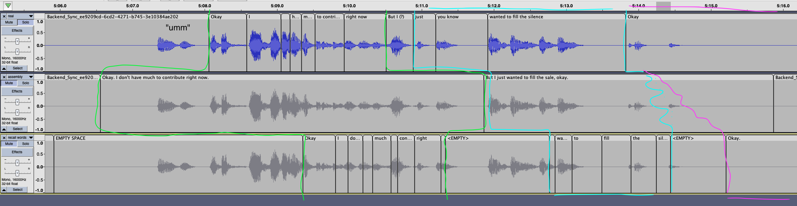

Simplest repro of AssemblyAI live transcription and its timestamps

We're using a wav file generated from one of our meeting recordings

## Setup

On a Mac, using `rtx` to manage python. You have to have `ffmpeg` installed

```
./setup.sh
```

Make sure to set up your AssemblyAI credentials in `configure.py`

## Analysis 

### Example 1

A chunk of the AssemblyAI results

```
297720 -> 300390:
297720 -> 300830:
297720 -> 301270:
297720 -> 301710: we can
297720 -> 302150: we can ship for sure
297720 -> 302590: we can ship for sure wait
297720 -> 303030: we can ship for sure wait for that
297720 -> 303470: we can ship for sure wait for that
297720 -> 303910: we can ship for sure wait for that especially if it's
297720 -> 304350: we can ship for sure wait for that especially if it's something
297720 -> 304790: we can ship for sure wait for that especially if it's something you're doing
297720 -> 305230: we can ship for sure wait for that especially if it's something you're doing in your free
297720 -> 305670: we can ship for sure wait for that especially if it's something you're doing in your free time
297720 -> 306110: we can ship for sure wait for that especially if it's something you're doing in your free time
297720 -> 306550: We can ship for sure. Wait for that. Especially if it's something you're doing in your free time.
306550 -> 307020:
306550 -> 307460:
306550 -> 307900:
```

Words we got from Recall:

```
=> select * from( select start_ms, end_ms, value, start_ms::integer - 297720 as diff from (select entry->>0 as start_ms, entry->>1 as value, entry->>2 as end_ms from (select jsonb_array_elements(results) as entry from transcripts where recording_id = 'ee9209cd-6cd2-4271-b745-3e10384ae202') as foo) AS baz) AS bar where start_ms::integer > 295000 and start_ms::integer <310760 order by start_ms asc;
 start_ms | end_ms |   value    | diff
----------+--------+------------+-------
 295219   | 295334 | What's     | -2501
 295659   | 295814 | eating?    | -2061
 295859   | 295894 | It.        | -1861
 297049   | 297084 | Yeah.      |  -671
 302359   | 302394 | For        |  4639
 302439   | 302474 | sure.      |  4719
 302839   | 302874 | Wait       |  5119
 303239   | 303274 | for        |  5519
 303359   | 303394 | that.      |  5639
 304039   | 304074 | Especially |  6319
 304239   | 304274 | if         |  6519
 304519   | 304594 | it's       |  6799
 304599   | 304634 | something  |  6879
 304919   | 305034 | you're     |  7199
 305039   | 305074 | doing      |  7319
 305399   | 305434 | in         |  7679
 305439   | 305474 | your       |  7719
 305559   | 305594 | free       |  7839
 305959   | 305994 | time.      |  8239
 309349   | 309384 | Okay.      | 11629
 309829   | 309864 | I          | 12109
 309909   | 309984 | don't      | 12189
 310189   | 310224 | have       | 12469
 310269   | 310304 | much       | 12549
 310589   | 310624 | to         | 12869
 310669   | 310864 | contribute | 12949
(26 rows)
```

How the audio file, the AssemblyAI live transcription and the Recall words align:



### Example 2

```
297720 -> 305230: we can ship for sure wait for that especially if it's something you're doing in your free
297720 -> 305670: we can ship for sure wait for that especially if it's something you're doing in your free time
297720 -> 306110: we can ship for sure wait for that especially if it's something you're doing in your free time
297720 -> 306550: We can ship for sure. Wait for that. Especially if it's something you're doing in your free time.
306550 -> 307020:
306550 -> 307460:
306550 -> 307900:
306550 -> 308340:
306550 -> 308780:
    306550 -> 309220: okay
    306550 -> 309660: okay i don't
    306550 -> 310100: okay i don't have much
    306550 -> 310540: okay i don't have much to contribute right
    306550 -> 310980: okay i don't have much to contribute right now
    306550 -> 311420: okay i don't have much to contribute right now
    306550 -> 311860: Okay. I don't have much to contribute right now.
    311860 -> 312330: but i just
    311860 -> 312770: but i just wanted to
    311860 -> 313210: but i just wanted to fill
    311860 -> 313650: but i just wanted to fill the
    311860 -> 314090: but i just wanted to fill the sale
    311860 -> 314530: but i just wanted to fill the sale
    311860 -> 314970: but i just wanted to fill the sale okay
    311860 -> 315410: but i just wanted to fill the sale okay
    311860 -> 315850: But I just wanted to fill the sale, okay.
315850 -> 316320:
315850 -> 316760:
```


From the recall bot session used to record this call we got the following timestamps:

```
=> select * from( select start_ms, end_ms, value, start_ms::integer - 309220 as diff from (select entry->>0 as start_ms, entry->>1 as value, entry->>2 as end_ms from (select jsonb_array_elements(results) as entry from transcripts where recording_id = 'ee9209cd-6cd2-4271-b745-3e10384ae202') as foo) AS baz) AS bar where start_ms::integer > 305230 and start_ms::integer <316760 order by start_ms asc;
 start_ms | end_ms |   value    | diff
----------+--------+------------+-------
 305399   | 305434 | in         | -3821
 305439   | 305474 | your       | -3781
 305559   | 305594 | free       | -3661
 305959   | 305994 | time.      | -3261
 309349   | 309384 | Okay.      |   129
 309829   | 309864 | I          |   609
 309909   | 309984 | don't      |   689
 310189   | 310224 | have       |   969
 310269   | 310304 | much       |  1049
 310589   | 310624 | to         |  1369
 310669   | 310864 | contribute |  1449
 310909   | 310944 | right      |  1689
 311269   | 311304 | now.       |  2049
 312779   | 312814 | I          |  3559
 312780   | 312815 | just       |  3560
 312859   | 312894 | wanted     |  3639
 313019   | 313054 | to         |  3799
 313499   | 313534 | fill       |  4279
 313899   | 313934 | the        |  4679
 314259   | 314454 | silence.   |  5039
 315219   | 315254 | Okay.      |  5999
```

How the audio file, the AssemblyAI live transcription and the Recall words align:


## Results 

Here are some key things I noticed (from the above screenshot and in general):

The AssemblyAI transcript chunks can have their **start timestamps** a bit too late, compared to the real audio file, but it's usually relatively accurate

The AssemblyAI transcript chunks usually have their **end timestamps** noticeably late - the chunks usually contain either a period of silence at the end, or even slightly overlap with the beginning of the next utterance. **Usually** the bulk of the information from the audio slice is **at the beginning of it** - closer to the start than to the end.

The beginnings of utterances are moved even further forward in time when using Recall.

Recall returns the timestamps of individual words, from the chunks streaming from AssemblyAI. It seems like it runs a heuristic, where it assumes the information is located roughly in the middle of a chunk returned from AssemblyAI and leaves segments of silence at the beginning and end of the utterance. It also seems to add more silence in the beginning than in the end.

This leads to the timestamps being "compressed" in time (grouped more tightly together) but also on average moved forward in time. 

The beginnings of utterances are affected the most - they're sometimes shifted forward by a couple of seconds


