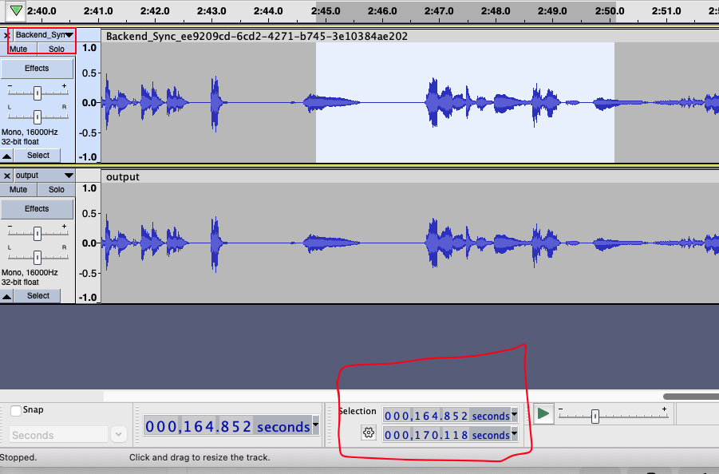

Simplest repro of AssemblyAI live transcription and its timestamps

We're using a wav file generated from one of our meeting recordings

## Setup

On a Mac, using `rtx` to manage python. You have to have `ffmpeg` installed

```
./setup.sh
```

Make sure to set up your AssemblyAI credentials in `configure.py`

## Results

A chunk of the results with the key part indented in:

```
156520 -> 164470: to production ready we could use that just kind of flagging it up and i don't know how much of a problem the memory consumption thing is for now for us
156520 -> 164910: To production ready. We could use that just kind of flagging it up. And I don't know how much of a problem the memory consumption thing is for now for us.
164910 -> 165380:
164910 -> 165820:
164910 -> 166260:
164910 -> 166700:
164910 -> 167140:
    164910 -> 167580: yeah
    164910 -> 168020: yeah
    164910 -> 168460: yeah i'd be really interested in
    164910 -> 168900: yeah i'd be really interested in seeing
    164910 -> 169340: yeah i'd be really interested in seeing how
    164910 -> 169780: yeah i'd be really interested in seeing how it
    164910 -> 170220: yeah i'd be really interested in seeing how it looks
    164910 -> 170660: yeah i'd be really interested in seeing how it looks
    164910 -> 171100: Yeah. I'd be really interested in seeing how it looks.
171100 -> 171570:
171100 -> 172010: let
171100 -> 172450: let's just see
171100 -> 172890: let's just see how we're doing
171100 -> 173330: let's just see how we're doing right now
```

You can see that the `Yeah. I'd be really interested in seeing how it looks.` quote goes from `164.910`s to `171.100`s.

You can see that it aligns with the audio waveform of both the video and the processed wav file:



However, from the recall bot session used to record this call we got the following timestamps:

```
=> select * from( select start_ms, end_ms, value, start_ms::integer - 164910 as diff from (select entry->>0 as start_ms, entry->>1 as value, entry->>2 as end_ms from (select jsonb_array_elements(results) as entry from transcripts where recording_id = 'ee9209cd-6cd2-4271-b745-3e10384ae202') as foo) AS baz) AS bar where abs(diff) < 5000 order by start_ms asc;
 start_ms | end_ms |    value    | diff
----------+--------+-------------+-------
 160229   | 160264 | how         | -4681
 160269   | 160304 | much        | -4641
 160629   | 160664 | of          | -4281
 160749   | 160784 | a           | -4161
 160789   | 160824 | problem     | -4121
 161469   | 161504 | the         | -3441
 161869   | 161984 | memory      | -3041
 162349   | 162544 | consumption | -2561
 162549   | 162584 | thing       | -2361
 162909   | 162944 | is          | -2001
 162989   | 163024 | for         | -1921
 163389   | 163424 | now         | -1521
 164189   | 164224 | for         |  -721
 164269   | 164304 | us.         |  -641
 167699   | 167734 | Yeah.       |  2789
 168379   | 168414 | If          |  3469
 168419   | 168494 | you're      |  3509
 168499   | 168534 | really      |  3589
 168619   | 168654 | interested  |  3709
 169019   | 169054 | in          |  4109
 169139   | 169174 | seeing      |  4229
 169899   | 169934 | how         |  4989
```

The beginning of `Yeah` is too late by 2.79 seconds!
